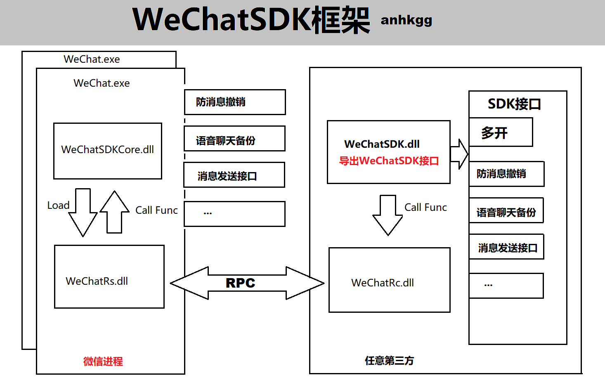

## WeChatSDK介绍

`WeChatSDK`提供方便操作`PC`端微信的超级接口，提供包括多开、防撤销、语音备份、消息发送、加好友等接口。第三方可以直接使用`WeChatSDK`来开发自己的应用，不用再在分析微信功能、协议上耗费精力，`WeChatSDK`替你完成。



`WeChatSDK`通过`WeChatSDK.dll`对外暴露接口，第三方只需要调用接口就能完成想要的功能。

`WeChatSDK.dll`内部通过`RPC`通信和注入到微信进程的`WeChatSDKCore.dll`进行功能调用，支持多开微信功能的调用，微信间互不影响。

## WeChatSDK使用

复制`WeChatSDK`目录中的`sdk.h`、`WeChatSDK.dll`以及`WeChatSDK.lib`（或者显示调用接口）到自己项目中，然后调用`sdk.h`中的接口定义进行代码开发即可。

发布时需要把所有模块都同时发布出去，包括`WeChatSDK.dll`，`WeChatSDKCore.dll`，`WeChatRs.dll`，`WeChatRc.dll`。

**源码目录介绍**

```
bin             //老版本
docs            //文档
sdk             //vs2017编译完成的sdk模块
common          //公共目录
WeChatSDK       //WeChatSDK.dll
WeChatRc        //WeChatRs.dll
WeChatRs        //WeChatRc.dll
WeChatSDKCore   //WeChatSDKCore.dll
WeChatSDKTest   //SDK示例，普通用户多开工具
```

编译顺序：

```
WeChatRs -> WeChatRc -> WeChatSDK -> WeChatSDKCore
```

## WeChatSDK接口

```
int WXOpenWechat();
启动微信，支持多开。返回值是微信进程pid，需保存用于后续接口调用。pid即代表多开的每个微信进程，指定pid调用接口使用操作对应的微信。

bool WXIsWechatAlive(DWORD pid);
检查微信是否启动成功，pid是WXOpenWechat返回值。返回true为成功。

int WXInitialize(DWORD pid);
初始化WeChatSDK。在调用其他接口之前需要调用此接口，否则SDK无法正常工作。pid是WXOpenWechat返回值。返回0表示成功。

int WXUninitialize(DWORD pid);
反初始化WeChatSDK，卸载SDK，一般不需要调用。pid是WXOpenWechat返回值。返回0表示成功。

bool WXIsWechatSDKOk(DWORD pid);
检查初始化WeChatSDK是否成功。在检查到成功之后才能调用其他接口，否则SDK无法正常工作。pid是WXOpenWechat返回值。返回true表示成功。

int WXAntiRevokeMsg(DWORD pid);
开启防消息撤销功能。pid是WXOpenWechat返回值。返回0表示成功。

int WXUnAntiRevokeMsg(DWORD pid);
关闭防消息撤销功能。pid是WXOpenWechat返回值。返回0表示成功。

int WXSaveVoiceMsg(DWORD pid, const wchar_t* path);
开启备份语音功能。pid是WXOpenWechat返回值，path指定语音备份位置的目录全路径。返回0表示成功。

int WXUnSaveVoiceMsg(DWORD pid);
关闭备份语音功能。pid是WXOpenWechat返回值。返回0表示成功。

int WXSendTextMsg(DWORD pid, const wchar_t* wxid, const wchar_t* msg);
发送文字消息接口，支持表情[x]。pid是WXOpenWechat返回值，wxid指定要发送对象的wxid，msg指定要发送内容。返回0表示成功。后续会提供通过微信名或昵称获取wxid接口。

//void WXSendGroupTextMsg(); //暂不支持
//void WXSendImageMsg(); //暂不支持
//void WXSendVoiceMsg(); //暂不支持
//void WXAddFriend(); //暂不支持
//void WXAddGroupFriends(); //暂不支持
//void WXAcceptFriend(); //暂不支持
//void WXDeleteFriend(); //暂不支持
//void WXGetUserWxid(); //暂不支持
```

详细请参考`WeChatSDKTest`使用方法。

## TODO

1. 加好友接口
2. 接受好友接口
3. 获取wxid
4. 删除好友
5. 加群好友
6. ...

欢迎PR或提供意见建议。

**开源不易，无数深夜的寒风需要你的点滴暖意。**

